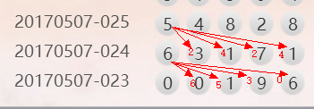

## 问题的关键

1. 自己内心根本不知道需要做出什么样类型的软件，所以导致自己总是在思考，但是就是没有结果，想想最终的产物需要完成的功能有哪些呢？
   + 最基本的功能：按时投注，到下期投注时间了，就自动执行投注
   + 需要实现的功能包括：投什么样的号码？什么时间该投注，什么时候不该投注？

## 一般买号步骤

1. 看最新开奖的那期期号和当前可投注的期号是否连续，连续才能进行下一步
2. 分析最新一期和前几期开奖的号码规律，进行选号，选号规则如下：
   + 定位胆（个位）
     + 杀连续的号码。比如：最新一期开8，上一期开7，那这期就会杀掉9，断定出现7,8,9这样的连号的可能性不大
     + 如果上期的开奖号码包含最新一期的个位号码，杀包含位。比如：上期开03456，最新开奖号码为：45893，上期的千位和最新期的个位3相同，那么当期可以杀掉千位5
     + 个位前三期号码形态，出现形如：717,828,949这样的首尾相同的，那么当前杀中间的号码。
     + 杀跨度的连号，需要结合前三期的开奖号码，入下图所示
3. 投注
4. 投注过程中如果发现盈利已经超过了1期的投注金额，则不再继续投注，当天收手了。比如：当天充值100元，投注几期后，发现资金到了116元，已经赚了16元，而每期投注花费的金额为16，那今天就不需要再玩了，已经达到盈利的最高峰了。